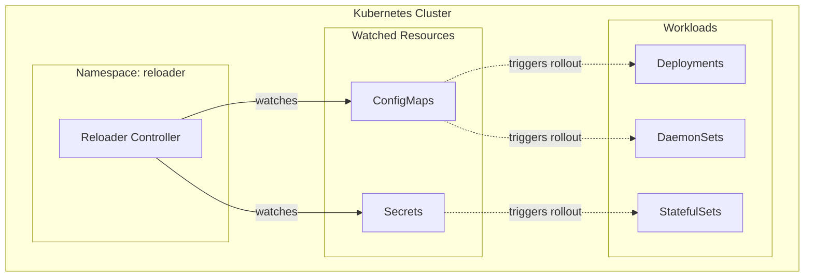
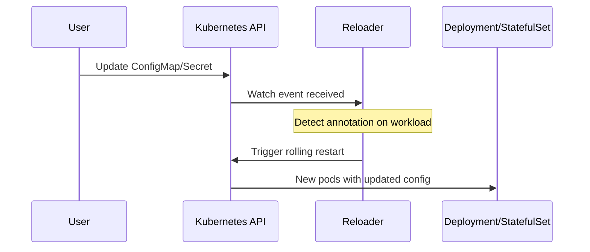

# Stakater Reloader Module

Terraform module for deploying [Stakater Reloader](https://github.com/stakater/Reloader) to Kubernetes. Automatically triggers rolling upgrades on Deployments, StatefulSets, and DaemonSets when their referenced ConfigMaps or Secrets are updated.

## Architecture



## How It Works



## Resources Created

- `kubernetes_namespace.reloader_namespace` - Dedicated namespace
- `helm_release.reloader` - Reloader Helm chart deployment

## Variables

This module has no input variables. It uses sensible defaults.

## Usage

The module is automatically deployed as part of the infrastructure. To use Reloader with your workloads, add one of these annotations:

**Watch specific ConfigMap:**

```yaml
metadata:
  annotations:
    reloader.stakater.com/auto: "true"
```

**Watch specific resources:**

```yaml
metadata:
  annotations:
    configmap.reloader.stakater.com/reload: "my-configmap"
    secret.reloader.stakater.com/reload: "my-secret"
```

## Helm Chart

| Property | Value |
|----------|-------|
| Repository | <https://stakater.github.io/stakater-charts> |
| Chart | reloader |

## References

- [Stakater Reloader GitHub](https://github.com/stakater/Reloader)
- [Helm Chart Documentation](https://github.com/stakater/Reloader/tree/master/deployments/kubernetes/chart/reloader)
