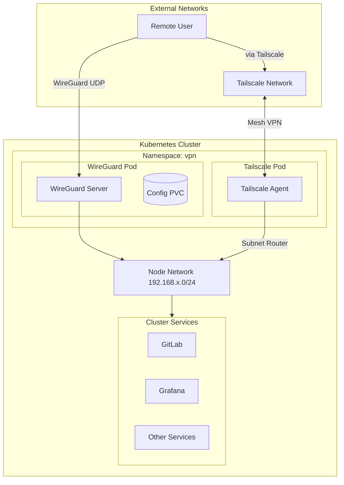
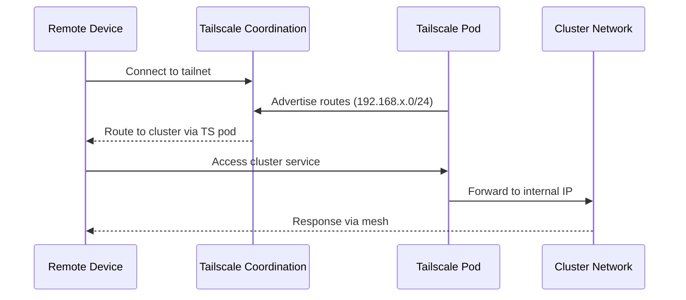

# VPN Module

Terraform module for deploying VPN solutions to Kubernetes. Supports both [Tailscale](https://tailscale.com/) mesh VPN and [WireGuard](https://www.wireguard.com/) server for secure remote access to the cluster network.

## Architecture



## Tailscale Architecture



## Resources Created

### Tailscale (when enabled)

- `kubernetes_secret.tailscale_auth_key` - Auth key secret
- `kubernetes_role_v1.tailscale` - RBAC role
- `kubernetes_service_account_v1.tailscale` - Service account
- `kubernetes_role_binding_v1.tailscale` - Role binding
- `kubernetes_deployment_v1.tailscale` - Tailscale agent deployment

### WireGuard (when enabled)

- `kubernetes_persistent_volume_claim_v1.wireguard_config` - Configuration storage
- `kubernetes_deployment_v1.wireguard` - WireGuard server deployment
- `kubernetes_service_v1.wireguard` - ClusterIP service (UDP)

## Variables

### Tailscale

| Name | Description | Default |
|------|-------------|---------|
| `tailscale_enable` | Enable Tailscale deployment | `false` |
| `tailscale_auth_key` | Tailscale auth key (from admin console) | (required, sensitive) |
| `tailscale_advertise_routes` | Routes to advertise (CIDR, comma-separated) | `192.168.0.0/24` |
| `tailscale_hostname` | Hostname shown in tailnet | `tailscale-kubernetes` |
| `tailscale_timezone` | Container timezone | `Australia/Melbourne` |

### WireGuard

| Name | Description | Default |
|------|-------------|---------|
| `wireguard_enable` | Enable WireGuard deployment | `false` |
| `wireguard_ingress_host` | Server hostname for client config | `wireguard.chrislee.local` |
| `wireguard_timezone` | Container timezone | `Australia/Melbourne` |
| `wireguard_port` | UDP port for WireGuard | `51820` |
| `wireguard_peers` | Number of peer configs to generate | `3` |

## Usage

### Tailscale Setup

1. **Generate Auth Key**

   - Go to [Tailscale Admin Console](https://login.tailscale.com/admin/settings/keys)
   - Create auth key (reusable, with tag `tag:kubernetes`)

2. **Configure Variables**

   ```bash
   TF_VAR_tailscale_enable=true
   TF_VAR_tailscale_auth_key="tskey-auth-xxxx"
   TF_VAR_tailscale_advertise_routes="192.168.1.0/24,10.96.0.0/12"
   ```

3. **Approve Routes**

   After deployment, approve advertised routes in Tailscale admin console.

### WireGuard Setup

1. **Configure Variables**

   ```bash
   TF_VAR_wireguard_enable=true
   TF_VAR_wireguard_ingress_host="vpn.chrislee.local"
   TF_VAR_wireguard_peers=5
   ```

2. **Get Peer Configs**

   ```bash
   kubectl logs -n vpn deployment/wireguard
   ```

   QR codes for each peer are displayed in logs.

3. **Configure NGINX for UDP**

   The NGINX module exposes port 51820 UDP for WireGuard traffic.

## Container Images

| Component | Image |
|-----------|-------|
| Tailscale | tailscale/tailscale |
| WireGuard | linuxserver/wireguard |

## Network Configuration

### Tailscale Features

- **Subnet Router**: Advertises cluster network to tailnet
- **Exit Node**: Can act as exit node for internet traffic
- **Accept Routes**: Receives routes from other tailnet nodes

### WireGuard Network

| Setting | Value |
|---------|-------|
| Internal Subnet | 10.13.13.0/24 |
| Allowed IPs | 0.0.0.0/0 (full tunnel) |
| DNS | Auto (uses cluster DNS) |

## References

- [Tailscale Kubernetes](https://tailscale.com/kb/1185/kubernetes/)
- [Tailscale Subnet Routers](https://tailscale.com/kb/1019/subnets/)
- [WireGuard Documentation](https://www.wireguard.com/)
- [LinuxServer WireGuard](https://docs.linuxserver.io/images/docker-wireguard/)
